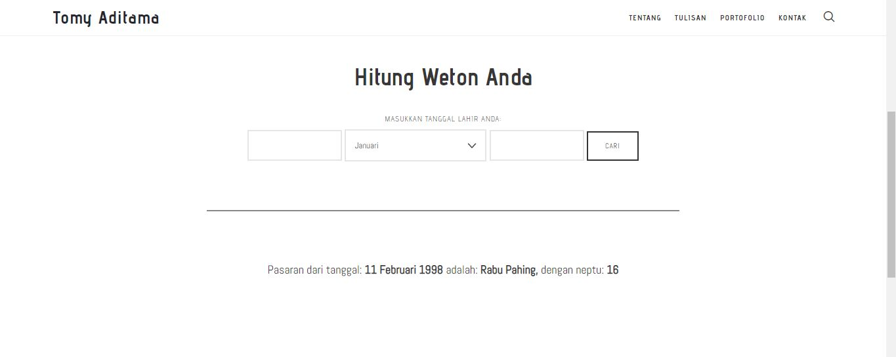

# Kalkulator Weton
Kalkulator Weton ini dibuat untuk platform CMS Wordpress dan digunakan sebagai alat pelengkap situs tomyaditama.com

## Penggunaan
Untuk menggunakan Plugin ini, anda cukup download dan install pada Wordpress anda. Kemudian untuk menampilkan, ketikkan shortcode ```[weton-jawa]``` pada halaman yang anda buat.

```Jika ada kekurangan, mohon saran dan kritiknya.```